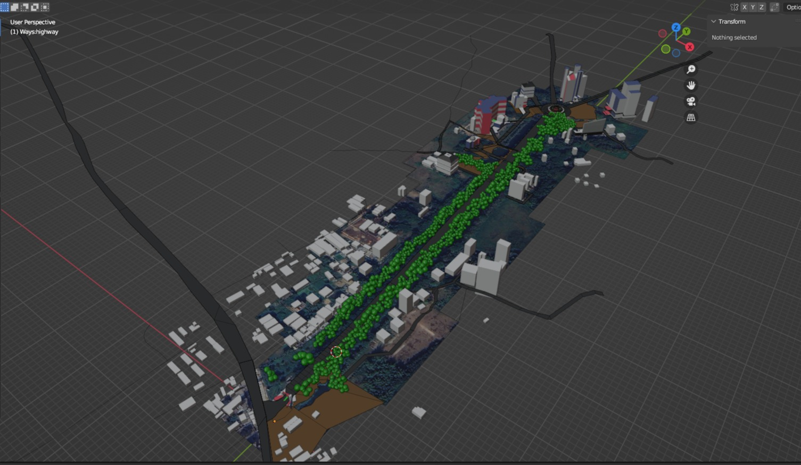
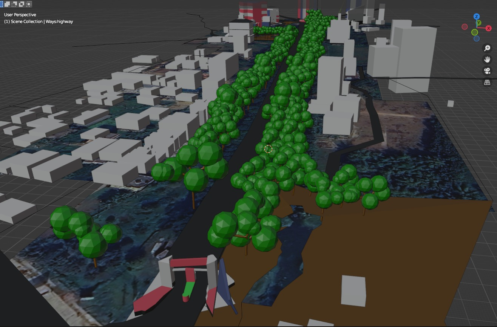
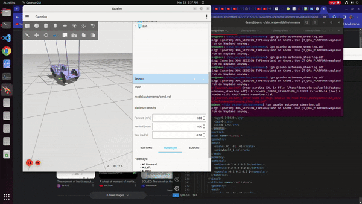

## 🖥️ Simulation Environment – Automama Campus World (Gazebo)

To enable safe, repeatable, and low-cost testing of the autonomous system, we developed a **custom Gazebo simulation environment** that replicates our university campus. This simulated world is used to test and validate Automama’s full autonomous stack, including **point-to-point navigation**, **control**, and **perception modules**.

---

### 🏙️ Environment Overview

- ✅ **Custom campus world** built in Gazebo using blueprints, maps, and satellite references
- ✅ **Automama vehicle model** with realistic physics, kinematics, and sensor integrations
- ⚠️ **Under development**: Static campus layout mostly complete; environment still lacks:
  - Dynamic actors (pedestrians, traffic vehicles)
  - Advanced road elements (signals, curbs, signage)
  - Photorealistic textures and materials

  
  

---

### 🚗 Vehicle Simulation

- The AGV Automama is modeled as a **4-wheeled differential or ackermann-drive vehicle**
- Integrated with:
  - Realistic **vehicle physics**
  - Simulated **rotary encoder** and **brake actuator**
  - Optional **camera, IMU, and LiDAR** plugins for perception testing
- Tuned for accurate **steering, acceleration, and braking response**

  

---

### 🧠 Stack Integration

The **control and perception stacks** of Automama have been successfully deployed and tested in this Gazebo world.

#### Tested Modules:
- ✅ Low-level control (steering, motor, braking)
- ✅ Sensor fusion (IMU, encoder)
- ✅ Point-to-point navigation planner
- ✅ Basic obstacle avoidance logic (using simulated LiDAR or depth input)

---

### 🚧 Roadmap & To-Dos

| Feature                        | Status         |
|-------------------------------|----------------|
| Static campus layout           | ✅ Completed    |
| Realistic AGV model            | ✅ Completed    |
| Perception testing             | ✅ In progress  |
| Traffic actors (cars, people)  | 🔜 Pending      |
| Road furniture & signage       | 🔜 Pending      |
| Photorealistic material maps   | 🔜 Pending      |
| ROS 2 integration              | ✅ Functional   |

---

### 🖼️ Custom Stereo Vision pipeline demo
## 📷 Stereo Vision Pipeline (Project Automama – AGV)

In **Project Automama (AGV)**, we developed a **custom stereo vision pipeline** to enable real-time 3D perception and depth estimation. The system was first validated in simulation, leveraging **GPU acceleration** for efficient processing.

### 🔑 Key Features
- 🔹 **Stereo Image Processing** – disparity map computation from dual-camera simulation feeds.  
- 🔹 **Depth Reconstruction** – conversion of disparity data into dense 3D point clouds.  
- 🔹 **GPU Acceleration** – optimized computations for real-time performance.  
- 🔹 **3D Point Cloud Visualization** – integrated with **VisPy**, enabling smooth, interactive rendering of point clouds in real time.  

This pipeline laid the foundation for robust AGV perception, supporting tasks such as **obstacle detection, mapping, and navigation** in dynamic environments.

  

---

### 📂 Folder Structure (Suggested)

<pre> 📁 <b>automama_simulation/</b> 
  ├── 📁 <b>models/</b> # All custom Gazebo models 
  │ ├── 📁 <b>automama_vehicle/</b> # URDF, mesh, and sensor plugins for the vehicle 
  │ └── 📁 <b>campus_assets/</b> # Buildings, roads, trees, and other environmental models 
  ├── 📁 <b>worlds/</b> # Gazebo world files 
  │ └── 🗎 <b>automama_campus.world</b> # Main world file replicating the campus 
  ├── 📁 <b>launch/</b> # ROS 2 launch files for simulation 
  │ └── 🗎 <b>simulation_launch.py</b> # Launches Gazebo with the world and robot 
  ├── 📁 <b>config/</b> # Parameter configs for vehicle and simulation 
  │ └── 🗎 <b>vehicle_params.yaml</b> # Vehicle tuning parameters (steering, motor, sensors) 
  ├── 📁 <b>rviz/</b> # RViz visualization configs 
  │ └── 🗎 <b>automama_nav.rviz</b> # RViz setup for navigation and debugging 
  └── 🗎 <b>README.md</b> # This documentation file </pre>
---

---

### 📚 Dependencies

- Gazebo (compatible with Ignition or Classic)
- ROS 2 Humble / Iron
- `gazebo_ros_pkgs`
- Custom plugins (for actuator/sensor simulation)

---

### 👥 Contributors

- Sim development by: [Your Simulation Team or Names]
- World modeling & physics: [Contributors]
- Vehicle model & URDF: [Contributors]

---

